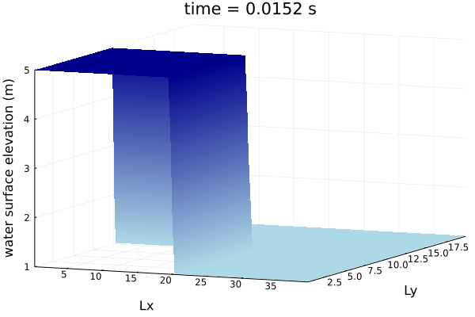
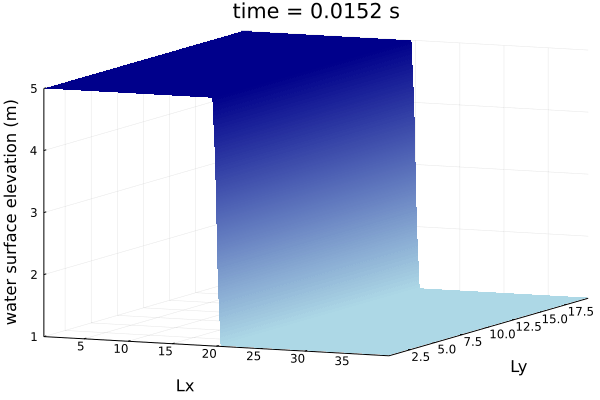
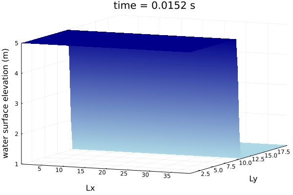
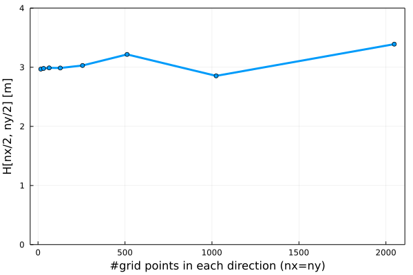

# Part 2: 2D Shallow Water Equations Solver
Solution of the shallow water equations in one and two dimensions. The equations are solved using Julia on multi-GPUs.

## Intro
The shallow water equations are a set of hyperbolic partial differential equations (PDEs) for describing shallow fluid flows. The shallow water equations are derived from depth-integration of the Navier-Stokes Equations, which describe continuity of mass and continuity of momentum of fluids. The shallow water equations assume a hydrostatic pressure distribution and constant velocity throughout fluid depth, along with the condition that horizontal length scale is significantly larger than than the vertical scale. The 2D shallow water equations include equations for conservation of mass, conservation of momentum in the x-direction, and conservation of momentum in the y-direction. The equations are shown here in conservative form for a horizontal bed, neglecting friction and viscous forces:

### Conservation of mass


### Conservation of momentum in X-direction


### Conservation of momentum in Y-direction  


The purpose of this shallow water equations solver is to model an instantaneous dam breach. The model domain has a length of 40 meters and a width of 20 meters. Half of the domain (a 20 meter x 20 meter region) has an initial water level of 5 meters, while the other half (also a 20 meter x 20 meter region) has an initial water level of 1 meter. The model setup matches that of a test case used in the validation of the software BASEMENT version 2.8, Test Case H_1 "Dam break in a closed channel" [^1]

<!-- What's all about. Brief overview about: -->
<!-- - the process -->
<!-- - the equations -->
<!-- - the aims -->
<!-- - ... -->

## Methods

### Spatial discretization
The model domain was spatially discretized into square-shaped (dx = dy) elements, with edge lengths of approximately 0.08 meters. There are 512 elements in the x-direction, and 256 elements in the y-direction. The model was initially tested with smaller sized elements, and then elements were coarsened to the maximum size at which accuracy was acceptable, in order to reduce computational cost.

### Temporal discretization
The temporal discretization (dt) is adapated throughout the simulation based on the CFL condition. The timestep must be small enough so that information cannot travel greater than the distance between computational elements (dx), with additional reduction to ensure convergence in 2D modeling. The dt is adjusted at the beginning of each time step, based on the maximum velocity in the system. The calculation of dt is shown here:  


### Solution approach: Lax-Friedrichs Method
The 2D shallow water equations were solved by utilizing the Lax-Friedrichs Method [^2][^3]. The Lax-Friedrichs Method is a forward in time, centered in space numerical scheme. For an equation of the form  


f(u) and g(u) are flux functions of u, artificial dissipation is applied to the flux functions in order to mitigate numerical instabilities. "Corrected" flux functions F(u) and G(u) are solved for at cell edges:  

  

  

where λ<sub>x</sub> and λ<sub>y</sub> are signal speeds in the x and y directions. λ<sub>x</sub> and λ<sub>y</sub> are functions of the adapting dt, and are calculated as:


The "corrected" flux functions F(u) and G(u) are then used to solved for the next iteration of the solution matrix U:  

  


<!--The methods to be used: -->
<!--- spatial and temporal discretisation -->
<!--- solution approach -->
- hardware
- ...

## Results

In this section, we discuss the results obtained for our implementation.

### 2D shallow water



| Animation of the 2D shallow water equations being solved with a 2D dam break. Each frame corresponds to one physical time-step. |
|:--:|



| Animation of the 2D shallow water equations being solved with a 1D dam break in x-direction. Each frame corresponds to one physical time-step. |
|:--:|



| Animation of the 2D shallow water equations being solved with a 1D dam break in y-direction. Each frame corresponds to one physical time-step. |
|:--:|

TODO: comment on visualization

### Performance

For the performance measurements we use the 2D xpu with MPI solver of the shallow water equations.

#### Memory throughput

Strong-scaling on CPU and GPU -> optimal "local" problem sizes.

We test the performance of the algorithm using only a single thread in a machine
with a single Intel Core i7 running at 2.5 GHz.

| Domain size     | Throughput (GB/s) | Time (s) |
| --------------- | ---------------   | -------- |
| 32              | 0.75              | 0.654   |
| 64              | 0.96              | 2.037    |
| 128             | 0.96              | 8.204    |
| 256             | 1.01            | 31.062  |
| 512             | 0.979            | 128.367  |

The Intel Core i7 has a theoretical memory bandwidth of 25.6GB/s[^4]. This means
that we are bounded by our computations, which makes sense since single CPU
cores are not efficient at tackling these kind of highly parallel problems
because of their sequential nature. 

We also conduct the same experiment on the GTX TITAN X, yielding the following
results:

| Domain size     | Throughput (GB/s) | Time (s) |
| --------------- | ---------------   | -------- |
| 32x32              | 0.13             | 3.727  |
| 64x64              | 0.50             | 3.921  |
| 128x128             | 1.61             | 4.870  |
| 256x256             | 3.66             | 8.586  |
| 512x512             | 7.79             | 16.129   |
| 1024x1024		| 13.60		 | 36.862	|
| 2048x2048		| 15.40		 | 130.262	|
| 4096x4096		| 17.10		 | 470.429 |
| 8192x8192		| 17.10		 | 1882.127|

The TITAN X has a theoretical maximum memory bandwidth of 336.6GB/s[^5]. Since our results are an order of magnitude lower than this theoretical maximum, it is clear that our performance is also compute bounded. This makes sense since our algorithm has some parts which are not optimally paralellisable (lot of control statements inside kernel) and since this model of GPU is fairly outdated, and back in the day the gap between memory and compute performances was not as big.

#### Weak scaling

Having found the optimal local problem size for the GTX TITAN X in the previous
section (4096), we now run the same problem in 1, 2 and 4 GPUs in order to
compare the total throughput achieved.

| Number of GPUs | Domain size | Throughput (GB/s) | Time (s) |
| -----------    | ----------  | ----------------  | -------- |
| 1              | 4096x4096 	| 17.10              | 470.429    |
| 2              | 8190x4096 	| 24.20             | 333.018    |
| 4              | 8190x8190 	| 24.00             | 334.780    |

In order to get these results, we used the command:

```bash
~/.julia/bin/mpiexecjl -n nproc julia --project scripts-part2/2D_SWE/shallow_water_2D_LF_xpu_mpi.jl
```
The script is called with (n is the grid size):
```julia
shallow_water_2D_xpu(; nx = n, ny = n, dam2D = false, dam1D_x = true, do_visu = false)
```

#### Work-precision diagrams

We now perform an evaluation of the algorithm convergence given a certain grid
refinement. Ideally, the more density of points we have the more our results
will imitate reality. To validate this, we are going to check the value at the
center of the domain given different grid sizes. We expect to observe that the
value converges as we increase the grid size.

We can see our results in the following table. 

| Size | H[nx/2, ny/2] m |
|------|------------------|
| 16   | 2.968512          |
| 32   | 2.980016          |
| 64   | 2.989295          |
| 128  | 2.987390          |
| 256  | 3.029586          |
| 512  | 3.216812          |
| 1024 | 2.854171		|
| 2048 | 3.390651		|

And the following plot shows it graphically.

 

## Discussion


TODO: Why work precision scaling doesn't converge.

## References
<!-- ## References -->
[^1]: [Vetsch, D., Siviglia, A., Caponi, F., Ehrbar, D., Gerke, E., Kammerer, S., Koch, A., Peter, S., Vanzo, D., Vonwiller, L., Facchini, M., Gerber, M., Volz, C., Farshi, D., Mueller, R., Rousselot, P., Veprek, R., & Faeh, R. (2018). System manuals of basement, Version 2.8., ETH Zurich: Zurich, Switzerland.](http://people.ee.ethz.ch/~basement/baseweb/download/documentation/BMdoc_Testcases_v2-8-1.pdf)
[^2]: [Lax, P.D. (1954), Weak solutions of nonlinear hyperbolic equations and their numerical computation. Comm. Pure Appl. Math., 7: 159-193.](https://doi.org/10.1002/cpa.3160070112)  
[^3]: [Rezzolla, L. (2020), Numerical Methods for the Solution of Partial Differential Equations. Institute for Theoretical Physics, Frankfurt, Germany.](https://itp.uni-frankfurt.de/~rezzolla/lecture_notes/2010/fd_evolution_pdes_lnotes.pdf)
[^4]: [https://www.intel.com/content/www/us/en/products/sku/83504/intel-core-i74870hq-processor-6m-cache-up-to-3-70-ghz/specifications.html](https://www.intel.com/content/www/us/en/products/sku/83504/intel-core-i74870hq-processor-6m-cache-up-to-3-70-ghz/specifications.html) 
[^5]: [https://www.techpowerup.com/gpu-specs/geforce-gtx-titan-x.c2632](https://www.techpowerup.com/gpu-specs/geforce-gtx-titan-x.c2632) 
